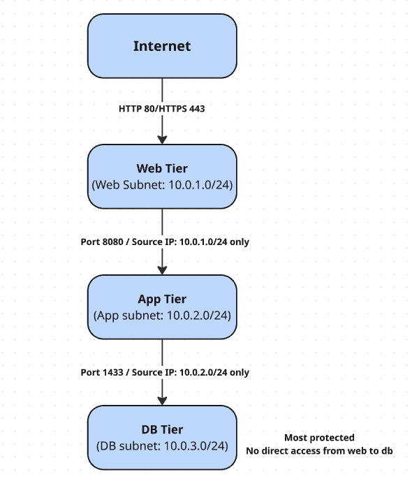
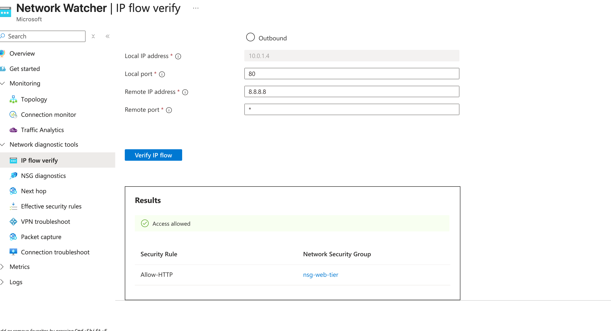
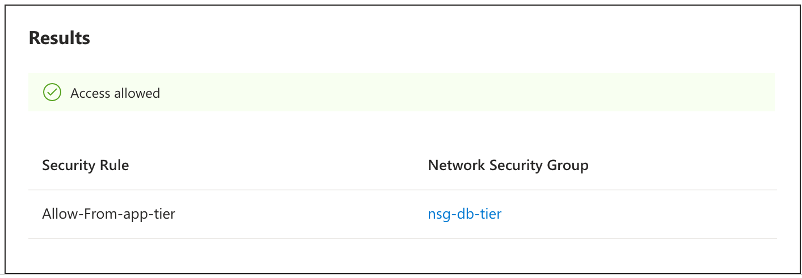
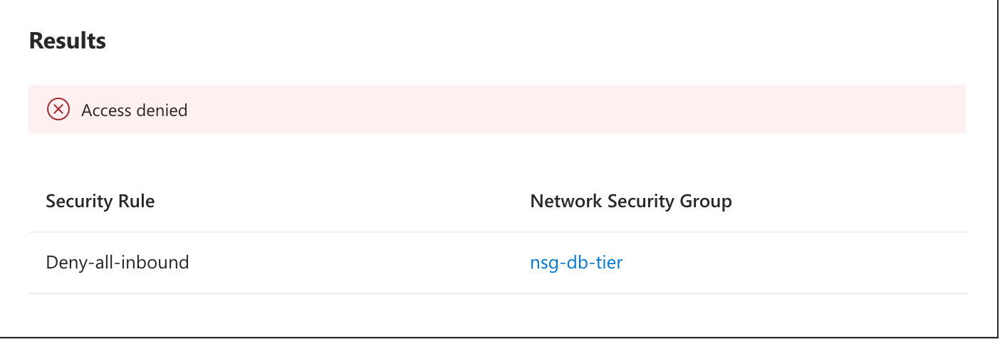

# Azure Network Security Group (NSG) Access Control

## Overview
Designed and deployed a secure 3-tier network architecture in Azure. Project completed using Network Security Groups (NSGs) to follow principle of least-privilege access control between network segments.

## Problem Statement
Often in enterprises, flat networks allow for attackers to move freely between systems once inside. This projects implements segmentation to contain breaches and reduce blast radius.

## Architecture

- **Web Tier (10.0.1.0/24):** Public facing, allows HTTP/HTTPS only
- **App Tier (10.0.2.0/24):** Internal only, accepts traffic from 
  web tier exclusively
- **DB Tier (10.0.3.0/24):** Highest restriction, accepts traffic 
  from app tier only on port 1433

## Security Rules Implemented
| Tier | Allowed Source | Port | All Other Traffic |
|------|---------------|------|-------------------|
| Web  | Any (internet) | 80, 443 | Denied |
| App  | 10.0.1.0/24 only | 8080 | Denied |
| DB   | 10.0.2.0/24 only | 1433 | Denied |

## Validation Testing
Used Azure Network Watcher IP Flow Verify to confirm all rules function as designed:

| Test | Source | Destination | Port | Expected | Result |
|------|--------|-------------|------|----------|--------|
| 1 | Internet (8.8.8.8) | vm-web | 80 | Allow |  |
| 2 | Internet (8.8.8.8) | vm-db | 1433 | Deny | .png)|
| 3 | vm-app (10.0.2.4) | vm-db | 1433 | Allow |  |
| 4 | vm-web (10.0.1.4) | vm-db | 1433 | Deny |  |

## Key Concepts Demonstrated
- Network segmentation and defense-in-depth
- Least privilege access control at the network layer
- Source-based IP filtering
- Explicit deny rules and priority-based rule evaluation
- Egress filtering for data exfiltration prevention
- Security validation and audit documentation

## Tools Used
- Microsoft Azure (VNet, NSGs, Network Watcher)
- Azure IP Flow Verify for security validation

## What Next
- Azure Bastion for secure sysadmin access to DB tier
- Outbound NSG rules for egress filtering
- Azure Monitor alerts for denied traffic spikes
